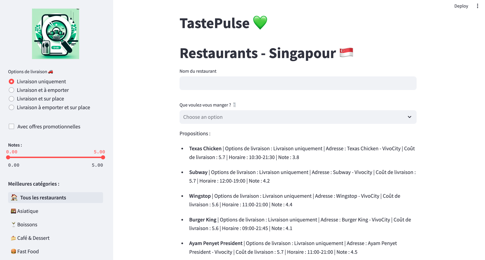

# TastePulse

TastePulse est une application web qui répertorie les restaurants de Singapour, offrant aux utilisateurs la possibilité de découvrir et de rechercher différents types de cuisine en partenariat avec le service de livraison d’Asie Grab. Que ce soit pour trouver un restaurant spécifique ou pour explorer de nouvelles options dans une catégorie particulière, TastePulse vous aide à trouver les meilleurs endroits où manger à Singapour !

## Objectif

Le but principal de TastePulse est de fournir aux utilisateurs une plateforme facile d’utilisation pour découvrir et explorer les divers restaurants de Singapour. L'application permet aux utilisateurs de rechercher des restaurants par nom ou de parcourir différentes catégories alimentaires pour trouver des options qui correspondent à leurs envies culinaires, en pouvant y ajouter certains filtres.

## Fonctionnalités

- *Recherche par nom de restaurant* : Les utilisateurs peuvent rechercher un restaurant spécifique en saisissant son nom dans la barre de recherche, et en modifiant également ses préférences concernant la livraison, la note du restaurant etc…
  
- *Recherche par catégorie alimentaire* : TastePulse propose une liste de catégories alimentaires telles que asiatique, fast-food, cuisine locale, etc. Les utilisateurs peuvent explorer ces catégories pour découvrir de nouveaux restaurants.

- *Informations sur le restaurant* : Pour chaque restaurant répertorié, TastePulse affiche des informations détaillées telles que l'adresse, la note moyenne des avis, etc.

## Installation

1. Cloner le dépôt GitHub :

   
   <pre><code id="code">
   git clone https://github.com/johannaroll/Linux.git
   </code></pre>
   
2. Accéder au répertoire du projet :
   
   
   <pre><code id="code">
   cd Linux
   </code></pre>

   ## Étape préalable : Générer l'API Kaggle

   1. Assurez-vous d'avoir un compte Kaggle et de vous connecter à Kaggle.

   2. Accédez à votre profil Kaggle et générez une clé API. Vous pouvez le faire en suivant ces étapes :
   - Allez sur [https://www.kaggle.com/account](https://www.kaggle.com/account)
   - Faites défiler jusqu'à la section API et cliquez sur "Create New API Token".
   - Cela téléchargera un fichier kaggle.json. Assurez-vous de le sauvegarder en toute sécurité.

   3. Placez le fichier kaggle.json dans le répertoire `data_collector/.kaggle/` de votre projet.

   ##

3. Installer les dépendances requises :
   
   
   <pre><code id="code">
   source install.sh
   </code></pre>
   
   

## Utilisation

1. Lancer l'application en spécifiant un mot-clé de recherche :
   
   
   
   <pre><code id="code">
   webapp/bin/launch.sh
   </code></pre>

2. Une fois l'application lancée, vous pouvez explorer les restaurants en utilisant la barre de recherche ou en parcourant les différentes catégories alimentaires disponibles.

## Technologies utilisées

- Python
- Shell

## Contributeurs

- Johanna Roll (johannaroll)
- Manal Jarmouni (nom_utilisateur_github)
- Maysa Slimani (mayslimani1)